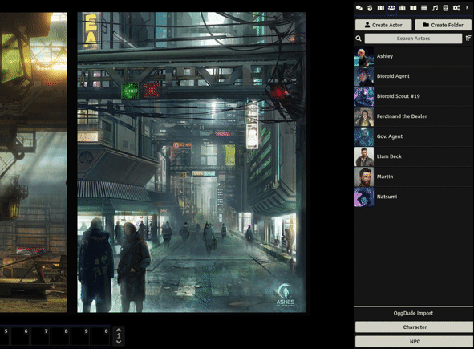

    
# Drag Anything To Hotbar for Foundry VTT

Allows drag & drop of Actors, Items, Roll Tables, Journals, Sounds and Playlists into the Macro Hotbar with the following effects:

* **Actors** - Open Sheet (Needs create new Tokens permission)
* **Journal Entries** - Open Journal
* **Roll Tables** - Draws from Table
* **Sounds** - Play a sound (Will only work from Foundry V9 and onwards)
* **Playlists** - Play/Stop toggle
* **Items** - Open Item (At world level)

### Notes
_For Non-GMs:_ Players need permission to see the entity in order to be able to drag and drop into the Hotbar. Except for **Actors** which also need the **permission to create new Tokens**. It is required in order to drag & drop actors. 

_For individual sounds:_ This Feature only works on the upcoming Foundry V9 since it is a new feature in Foundry to be able to drag and drop sounds.

### [Invite me a coffee if you like this module :D](https://ko-fi.com/jeansenvaars)

## Check my other modules

* [Minimal UI](https://github.com/saif-ellafi/foundryvtt-minimal-ui)
* [Window Controls](https://github.com/saif-ellafi/foundryvtt-window-controls)
* [Super Select](https://github.com/saif-ellafi/foundryvtt-super-select)
* [Actor Link Indicator](https://github.com/saif-ellafi/foundryvtt-actor-link-indicator)
* [Mythic GME Tools](https://github.com/saif-ellafi/foundryvtt-mythic-gme)

## Known Issues

Playlist toggle icon won't change if playing the playlist from the playlist instead of the macro

## By JeansenVaars

# Appreciations

* Thanks to the FoundryVTT Discord community for the amazing issue reports and feedback.

# License

[MIT License](./LICENSE.md)

# Powered By

Thanks to JetBrains I can work on this project using **WebStorm**.
